# 32 Types of Crop Diseases in Leaf Surface Dataset

Original dataset information:
Total number of images in all subfolders: 38,808
Number of images in the folder "Peach Healthy Leaves": 360
Number of images in the folder "Peach Bacterial Spot Disease": 2,297
Number of images in the folder "Cherries Healthy Leaves": 854
Number of images in the folder "Cherries Fungal Disease": 1,052
Number of images in the folder "Corn Healthy Leaves": 1,162
Number of images in the folder "Corn Wilt Disease": 985
Number of images in the folder "Tomato Twospotted Bug Disease": 1,676
Number of images in the folder "Tomato Healthy Leaves": 1,591
Number of images in the folder "Tomato Fusarium Leaf Mold": 952
Number of images in the folder "Tomato Early Blast": 1,000
Number of images in the folder "Tomato Late Blast": 1,909
Number of images in the folder "Tomato Bacterial Spot Disease": 2,127
Number of images in the folder "Tomato Mosaic Disease": 373
Number of images in the folder "Tomato Plasmopara Viticola Leaf Spot": 1,771
Number of images in the folder "Tomato Target Spot": 1,404
Number of images in the folder "Tomato Yellowing Curled": 5,357
Number of images in the folder "Apple Healthy Leaves": 1,645
Number of images in the folder "Apple Rust": 275
Number of images in the folder "Apple Black Spot": 630
Number of images in the folder "Apple Black Rot": 621
Number of images in the folder "Strawberry Healthy Leaves": 456
Number of images in the folder "Strawberry Blight": 1,109
Number of images in the folder "Vinegar Green Mold": 423
Number of images in the folder "Vinegar Green Blight": 1,076
Number of images in the folder "Vinegar Green Mosaic": 1,383
Number of images in the folder "Vinegar Green Target": 1,180
Number of images in the folder "Vinegar Red Rot": 1,180
Number of images in the folder "Capsicum Healthy Leaves": 1,478
Number of images in the folder "Capsicum Blight": 997
Number of images in the folder "Capsicum Black Rot": 1,180
Number of images in the folder "Capsaicin Powdered Blight": 1,180
Number of images in the folder "Potato Healthy Leaves": 152
Number of images in the folder "Potato Early Blast": 1,000
Number of images in the folder "Potato Late Blast": 1,000
Total number of images in all subfolders: 38,808

Overall screenshot:
## Images

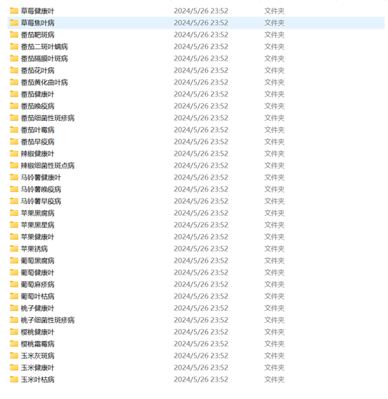
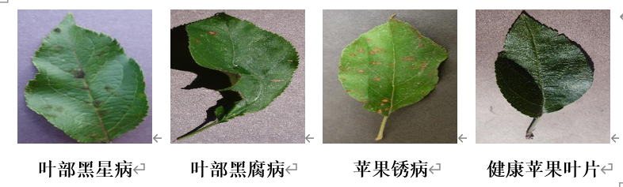
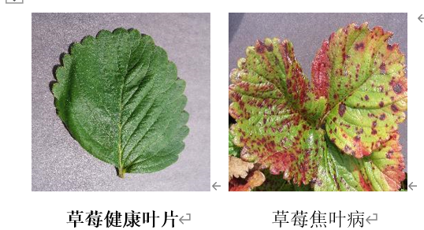
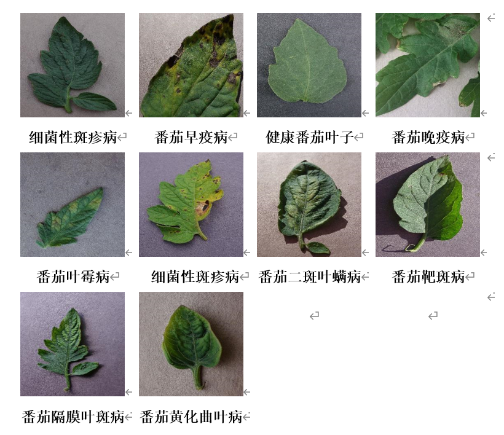
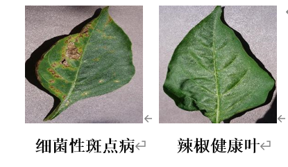
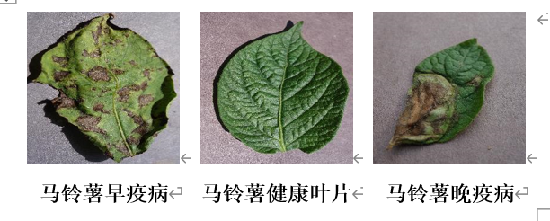
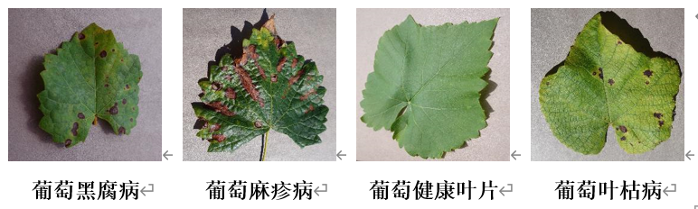
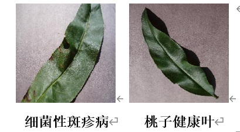
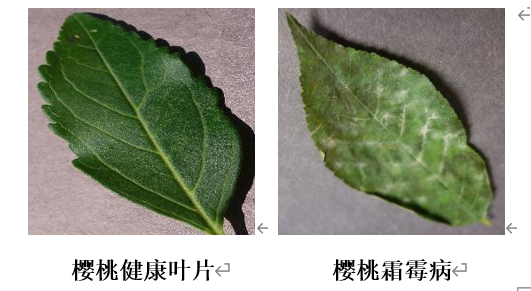
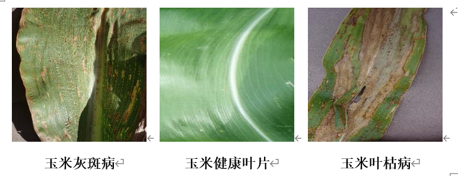
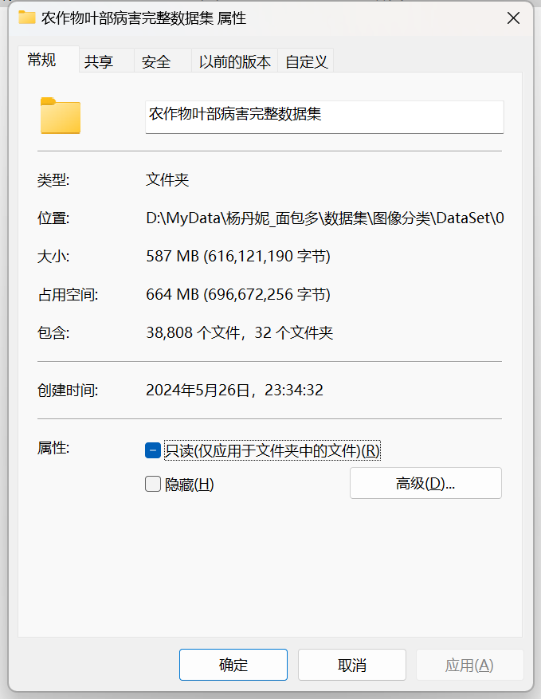
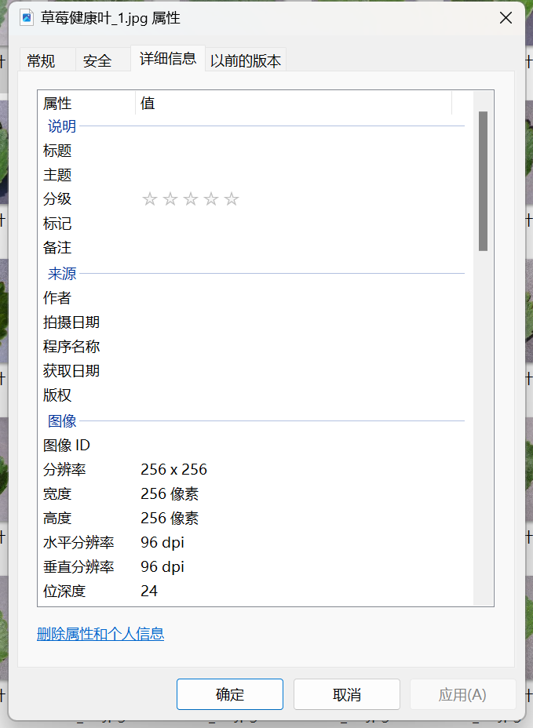

Here is a pay link on Stripe ( https://buy.stripe.com/3cs8yP7sY87d0vu9AB ). Please contact me lonlonago@foxmail.com after funding $89, and I will send you a complete data files , thank you!

